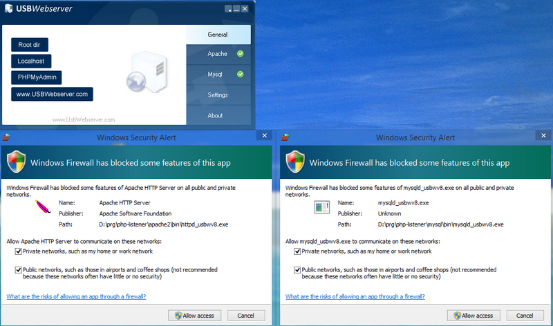

# FF NumberOK Simple Licence Plates Database Manager 

 * Add, remove, bulk import license plates
 * Add and edit groups

<!-- START doctoc generated TOC please keep comment here to allow auto update -->
<!-- DON'T EDIT THIS SECTION, INSTEAD RE-RUN doctoc TO UPDATE -->
**Table of Contents**  

- [Codebase Structure](#codebase-structure)
- [Installation](#installation)
- [Typical Use Scenario](#typical-use-scenario)
  - [Getting prepared](#getting-prepared)
  - [Managing groups](#managing-groups)
  - [Editing LP](#editing-lp)
  - [Import LPs in bulk](#import-lps-in-bulk)
- [Tech Details](#tech-details)

<!-- END doctoc generated TOC please keep comment here to allow auto update -->

## Codebase Structure

 * `img/` - contains illustrations, not required to run the service
 * `ff-numberok-lpdb/` - common features
   - `db-*.php` - database management
   - `time-tz-reset.php` - set timezone to UTC
   - `dbconnect.php` - database connection script
   - `groups.php` - group management
   - `lp.php` - add/remove license plates
   - `lpimport.php` - lp bulk import (with a purge option)
 * `root/` - front end entry points
   - `index.php` - user entry point
   - `index-dflt.php` - web server info (`phpinfo`)
 * `settings/php.ini` - adjusted settings for `php`

The only difference in `settings/php.ini` against the one from
web server distribution is that customized `ini` sets
`date.timezone` to `Europe/Kiev`.

[_- TOC -_ ](#table-of-contents)  

## Installation

Install any Apache+PHP web server.

The project is structured to fit portable standalone
[UsbWebServer](usbwebserver.com).
However the codebase can be mapped upon any other AMP server.

Mapping rules:
 * `root/` contents `=>` web server doc root
 * `ff-numberok-lpdb/` should be located at the same level as the doc root folder
 * `php.ini`: set `date.timezone` property to your current location

Grant Apache and MySQL whatever permissions your OS requires.

Launch the web server.

Navigate to [localhost](localhost), [localhost:8080](localhost:8080) or other
`host:port` as your web server instance requires.

[_- TOC -_ ](#table-of-contents)  

## Typical Use Scenario

### Getting prepared

 1. Check the path to `NumberOK.ini` file (default location is
    `C:\ProgramData\FF\NumberOk3\NumberOk.ini`) and click `Import`.
 2. Confirm database credentials and click `Connect`.

If connection fails you'll be prompted, otherwise redirected to
operations pages.

> You may need completing connection form manually should you
> launch the service on a computer different from that NumberOK
> DB is installed on.
 
### Managing groups

Add groups and edit groups' properties.

Nota Benes:
 1. Should you require to remove a group, please, employ native NumberOK
    tools.
 2. Group removal also removes license plates associated therewith.
 3. Any License Plate can be associated with one and only one group.
    Should you require an LP be associated with two groups for access
    management purposes you may need creating more groups so any LP
    belongs to a single group only and access is managed on the groups
    level.

[_- TOC -_ ](#table-of-contents)

### Editing LP

 1. Choose one or more groups to display LPs from
 2. Remove LPs in bulk or per selection
 3. Change country attribution per selection
 4. Add, remove, change group attribution per each LP as appropriate
 5. Edit LP details

Restrictions:
 1. LP id can contain only Latin letters and digits
 2. LP cannot contain spaces, dashes or any other delimiters
 3. Duplicate LPs are not allowed
 3. Any LP can be associated with any single group only

Whenever either restriction not observed an error will be reported.
 
[_- TOC -_ ](#table-of-contents)

### Import LPs in bulk

 1. Select a group to import LPs into
 2. Choose default country (you may edit this later)
 3. Upload a `csv` or `txt` file, or copy paste LPs to the textarea, and
    choose input formatting options
 4. Action!

Restrictions: _see restrictions above_

Notes on input data formatting (`csv`, `txt`, manual input):
 - by default spaces, tabs, `,`, `;`, `-`, and newline delimit license
   plates
 - should you opt for rich data (LP + owner name) it is expected that
   every line contains data for a single LP, where first alphanumeric
   sequence deemed an LP and owner's name constitutes the remainder of
   the line

[_- TOC -_ ](#table-of-contents)

## Tech Details

The service uses the following values imported from 
`C:\ProgramData\FF\NumberOk3\NumberOk.ini`:
 * `Database.FB_Password`
 * `Database.FB_Path`
 * `Database.FB_User`
 * `Database.FB_host`
 * `Database.FB_port`
 * `Database._Type` 

[_- TOC -_ ](#table-of-contents)
